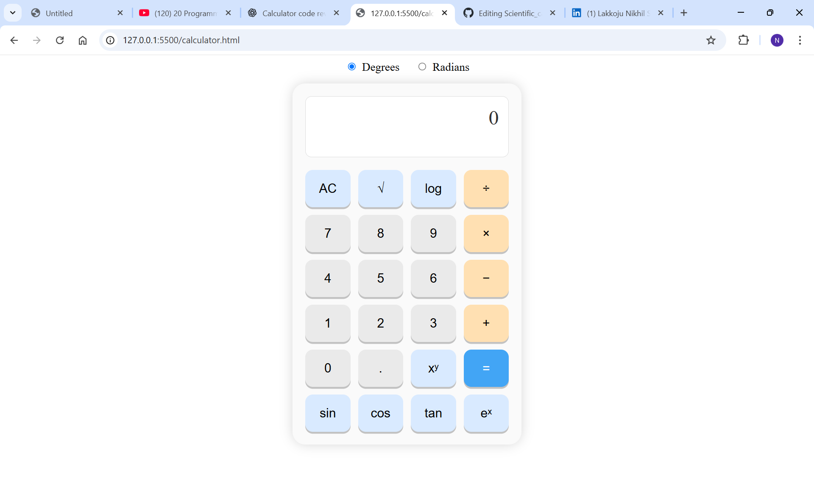

# 🧮 Scientific Calculator Web App  
A modern scientific calculator built using **HTML, CSS, and JavaScript**.  
This calculator supports both **basic arithmetic** and **advanced scientific operations**, all through a clean button-based UI inspired by real handheld calculators.

---

## ✅ Features

### 🌟 Basic Operations
- Addition (+)
- Subtraction (−)
- Multiplication (×)
- Division (÷)

### 🌟 Scientific Functions
- **Square root (√x)**
- **Power (xʸ)**
- **Logarithm base 10 (log)**
- **Natural logarithm (ln)**
- **Exponential (eˣ)**
- **Trigonometric functions:**  
  ✅ sin  
  ✅ cos  
  ✅ tan  

### 🌟 Additional Functionality
- **Degrees ↔ Radians toggle**
- **Cleaner output formatting**  
  (removes weird floating values like `6.123e-17`)
- **AC (clear) button**
- **Decimal support**
- **Smooth button press animation**
- **Light Theme Interface**

---

## 🛠️ Tech Stack

| Technology | Use |
|-----------|-----|
| **HTML5** | Structure |
| **CSS3** | Layout + Light Theme UI |
| **JavaScript (ES6)** | Calculator logic, trig mode, numeric formatting |

---

## 📁 Project Structure

/project-folder
│-- index.html
│-- st.css
│-- script.js (optional if you separated JS)
│-- README.md

markdown
Copy code

---

## 🚀 Getting Started

1. Download or clone this repository  
2. Open **index.html** in a browser  
3. The scientific calculator loads instantly  
4. Use the **Degrees/Radians toggle** before doing trigonometric calculations  

---

## 🔧 How It Works

### ✅ Number buttons
- Append digits to current input  
- Display updates immediately  

### ✅ Arithmetic operators
- Save current input → `previous`
- Wait for next input → `current`
- Store selected operator  

### ✅ Scientific functions  
Immediate operations:
- √x  
- log(x)  
- ln(x)  
- sin(x), cos(x), tan(x)  
- eˣ  

Power operation:
- Press `xʸ` → enter exponent → press `=`  

### ✅ Degrees / Radians toggle  
- **Degrees mode ON**  
  Converts input:  
radians = degrees * (Math.PI / 180)

yaml
Copy code

- **Radians mode ON**  
Uses input directly  

### ✅ Clean Output Formatting  
- Tiny floating numbers (< 1e-10) become `0`  
- Results rounded up to 10 decimal places  

---

## 🎨 User Interface

- Clean and minimal light theme  
- Grid-based button layout  
- Soft shadows for calculator-like appearance  
- Highlighted function and operator buttons  
- Responsive button press animation  

---

  

## ✅ Future Enhancements (optional)

- Add Dark Mode  
- Add Backspace/Delete key  
- Add parentheses support  
- Add π, e constants  
- Add factorial (!)  
- Add history panel  
- Add memory functions (M+, M-, MR)  

---

## 👨‍💻 Author  
**Lakkoju Nikhil Sai Phaneendra**  
  linkedin.com/in/lakkoju-nikhil
  github.com/lakkojunikhil2007-tech

---
